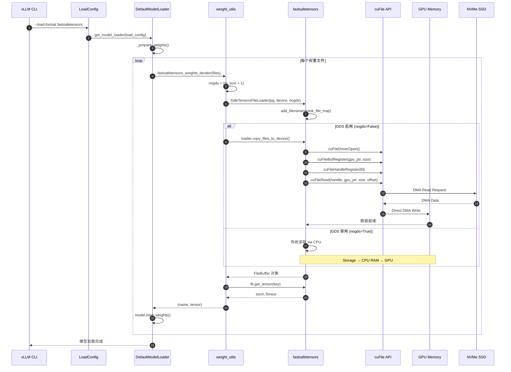
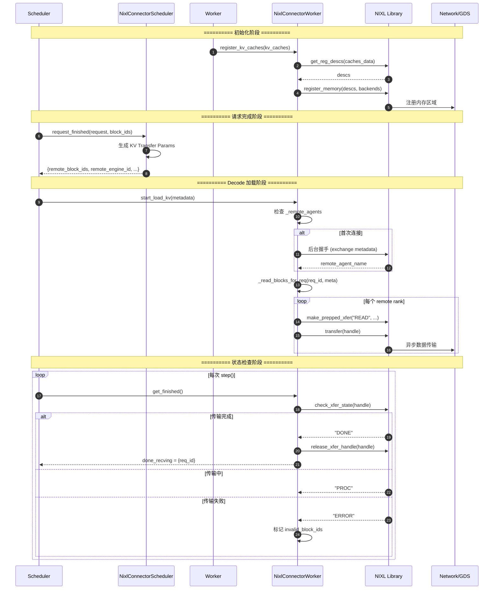
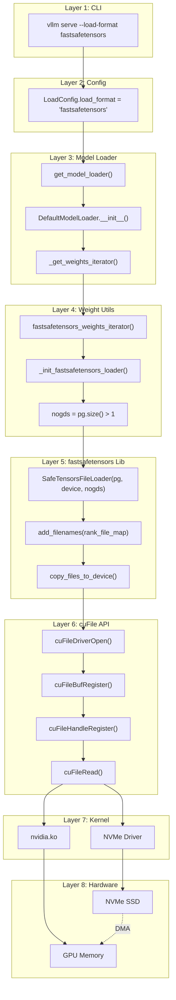
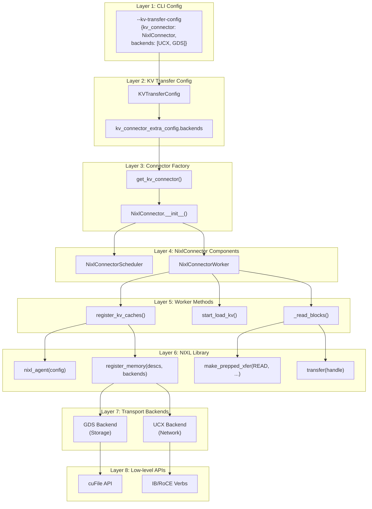

# vLLM 对 GPU Direct Storage (GDS) 的完整调用链分析

> 本文档深入分析从 vLLM 应用层到 NVIDIA GPU Direct Storage 底层内核模块的**每一层**调用关系，包括函数签名、参数含义、数据流转和核心逻辑。

---

## 目录

1. [技术背景](#1-技术背景)
2. [环境要求和前置条件](#2-环境要求和前置条件)
3. [整体架构概览](#3-整体架构概览)
4. [调用路径一：模型权重加载（fastsafetensors）](#4-调用路径一模型权重加载fastsafetensors)
5. [调用路径二：KV Cache 传输（NIXL/NixlConnector）](#5-调用路径二-kv-cache-传输nixlnixlconnector)
6. [PyTorch GDS 层详解](#6-pytorch-gds-层详解)
7. [NVIDIA cuFile SDK 层](#7-nvidia-cufile-sdk-层)
8. [内核模块层](#8-内核模块层)
9. [Mermaid 完整架构图](#9-mermaid-完整架构图)
10. [验证 GDS 是否生效](#10-验证-gds-是否生效)
11. [故障排查指南](#11-故障排查指南)
12. [性能调优指南](#12-性能调优指南)
13. [常见问题 FAQ](#13-常见问题-faq)
14. [技术原理深入](#14-技术原理深入)
15. [参考文献](#参考文献)

---

## 1. 技术背景

### 1.1 什么是 GPU Direct Storage (GDS)?

GPU Direct Storage 是 NVIDIA 提供的**零拷贝**数据传输技术：

| 传统路径 | GDS 路径 |
|---------|---------|
| Storage → CPU RAM → GPU Memory | Storage → **GPU Memory (Direct DMA)** |
| 2 次拷贝，CPU 瓶颈 | 0 次拷贝，绕过 CPU |
| PCIe + 内存带宽受限 | NVMe + PCIe 直通，带宽最大化 |

### 1.2 GDS 在 vLLM 中的两个使用场景

| 场景 | 用途 | 实现路径 |
|------|------|---------|
| **模型权重加载** | 启动时快速加载大模型权重到 GPU | `fastsafetensors` → `cuFile` |
| **KV Cache 传输** | Disaggregated Prefilling 场景下跨节点传输 KV Cache | `NIXL` → `cuFile` / `UCX` |

---

## 2. 环境要求和前置条件

> **⚠️ 重要**：GDS 不是"开箱即用"的技术。以下条件**必须全部满足**，否则 GDS 会静默回退到传统 CPU 路径。

### 2.1 硬件要求

| 组件 | 最低要求 | 推荐配置 |
|------|---------|---------|
| **GPU** | Volta 架构 (V100) | Ampere (A100) / Hopper (H100) |
| **GPU 内存** | 16 GB | 80 GB (A100 80GB / H100) |
| **存储** | NVMe SSD (PCIe 3.0) | NVMe SSD (PCIe 4.0/5.0) |
| **PCIe** | PCIe 3.0 x16 | PCIe 4.0/5.0 x16 |
| **服务器** | x86_64 服务器 | NVIDIA 认证服务器 |

**已知支持的 GPU 型号**：
- A100 (40GB/80GB) PCIe/SXM4
- H100 PCIe/SXM5
- RTX A6000 / A6000 ADA
- L40 / L40S

**不支持 GDS 的 GPU**：
- GeForce 消费级显卡 (RTX 3090/4090 等)
- 较老架构 (Kepler, Maxwell, Pascal)

### 2.2 软件要求

| 组件 | 最低版本 | 推荐版本 |
|------|---------|---------|
| **CUDA Driver** | 450.80+ | 525+ (for A100/H100) |
| **CUDA Toolkit** | 11.4+ | 12.0+ |
| **cuFile SDK** | 1.4+ | 1.7+ |
| **NVIDIA Driver** | 450.80+ | 525+ |
| **Linux Kernel** | 4.18+ | 5.15+ |

### 2.3 内核模块要求

```bash
# 检查必需的内核模块是否加载
lsmod | grep -E "nvidia|nvidia_uvm|nvidia_peermem"

# 预期输出：
# nvidia              XXXXXXX  X
# nvidia_uvm          XXXXXXX  X
# nvidia_peermem      XXXXXXX  X
# nvidia_drm          XXXXXXX  X
```

如果模块未加载：
```bash
sudo modprobe nvidia
sudo modprobe nvidia_uvm
sudo modprobe nvidia_peermem
```

### 2.4 文件系统要求

GDS 对文件系统有严格要求：

| 文件系统 | GDS 支持 | 配置要求 |
|---------|---------|---------|
| **XFS** | ✅ 推荐 | 推荐 `extsize=4K` 对齐 |
| **ext4** | ✅ 支持 | 需要 `dioread_nolock` mount 选项 |
| **GPFS** | ✅ 支持 | IBM Spectrum Scale |
| **BeeGFS** | ⚠️ 部分支持 | 可能有兼容性问题 |
| **NFS** | ❌ 不支持 | 必须使用 RDMA 版本 |
| **tmpfs** | ❌ 不支持 | 无实际存储设备 |

**XFS 最佳实践**：
```bash
# 创建 XFS 文件系统（推荐）
sudo mkfs.xfs -f -d su=1g,sw=4 -f /dev/nvme0n1

# 挂载选项
sudo mount -t xfs -o noatime,nodiratime /dev/nvme0n1 /mnt/nvme
```

### 2.5 cuFile 配置文件

GDS 需要配置 `/etc/cufile.json`：

```json
{
    "properties": {
        "allocation.policy": "cuda",
        "buffer.size": "4194304"
    }
}
```

**关键配置项**：
| 配置项 | 默认值 | 说明 |
|-------|-------|------|
| `allocation.policy` | `cuda` | 内存分配策略 |
| `buffer.size` | `4194304` (4MB) | 缓冲区大小 |
| `use_compat_mode` | `true` | 兼容模式（回退到 POSIX） |

### 2.6 快速验证脚本

```bash
#!/bin/bash
# gds_check.sh - 验证 GDS 环境是否就绪

echo "=== GPU Direct Storage 环境检查 ==="

# 1. GPU 检查
echo -n "1. GPU 型号: "
nvidia-smi --query-gpu=name --format=csv,noheader | head -1

# 2. CUDA 驱动版本
echo -n "2. CUDA Driver: "
nvidia-smi --query-gpu=driver_version --format=csv,noheader | head -1

# 3. 内核模块
echo -n "3. 内核模块: "
lsmod | grep -q nvidia_uvm && echo "OK (nvidia_uvm loaded)" || echo "MISSING (nvidia_uvm not loaded)"

# 4. NVMe 设备
echo -n "4. NVMe 设备: "
lsblk -d -o NAME,ROTA | grep -q "nvme.*0" && echo "OK" || echo "WARNING: No NVMe detected"

# 5. cuFile 配置
echo -n "5. cuFile 配置: "
test -f /etc/cufile.json && echo "OK (/etc/cufile.json exists)" || echo "MISSING"

# 6. GDS 功能检查
echo -n "6. GDS 功能: "
if command -v cufile-bounce-buffer-test &> /dev/null; then
    cufile-bounce-buffer-test 2>&1 | grep -q "PASSED" && echo "OK" || echo "FAILED"
else
    echo "SKIP (cufile-bounce-buffer-test not found)"
fi

echo "=== 检查完成 ==="
```

---

## 3. 整体架构概览

```
┌─────────────────────────────────────────────────────────────────────────┐
│                           vLLM Application                               │
│  ┌───────────────────────┐    ┌───────────────────────────────────────┐│
│  │   Model Weight Load   │    │       KV Cache Transfer               ││
│  │  --load-format        │    │  --kv-transfer-config                 ││
│  │  fastsafetensors      │    │  NixlConnector                        ││
│  └───────────┬───────────┘    └───────────────────┬───────────────────┘│
└──────────────│────────────────────────────────────│────────────────────┘
               │                                    │
               ▼                                    ▼
┌──────────────────────────────┐   ┌──────────────────────────────────────┐
│    fastsafetensors Library   │   │           NIXL Library               │
│  ┌─────────────────────────┐ │   │  ┌────────────────────────────────┐ │
│  │ SafeTensorsFileLoader   │ │   │  │ nixl_agent                     │ │
│  │ .copy_files_to_device() │ │   │  │ .register_memory()             │ │
│  │ .get_tensor()           │ │   │  │ .make_prepped_xfer()           │ │
│  └───────────┬─────────────┘ │   │  │ .transfer()                    │ │
└──────────────│───────────────┘   │  └───────────────┬────────────────┘ │
               │                   └──────────────────│───────────────────┘
               │                                      │
               └──────────────────┬───────────────────┘
                                  │
                                  ▼
┌─────────────────────────────────────────────────────────────────────────┐
│                         PyTorch GDS Layer                                │
│  ┌────────────────────────────────────────────────────────────────────┐ │
│  │ torch.cuda.gds.GdsFile                                             │ │
│  │   .register_handle()  → cuFileHandleRegister()                     │ │
│  │   .load_storage()     → cuFileRead()                               │ │
│  │   .save_storage()     → cuFileWrite()                              │ │
│  └────────────────────────────────────────────────────────────────────┘ │
└─────────────────────────────────────────────────────────────────────────┘
                                  │
                                  ▼
┌─────────────────────────────────────────────────────────────────────────┐
│                      NVIDIA cuFile SDK (libcufile.so)                    │
│  ┌────────────────────────────────────────────────────────────────────┐ │
│  │ cuFileBufRegister()     - 注册 GPU 内存缓冲区                       │ │
│  │ cuFileHandleRegister()  - 注册文件句柄                              │ │
│  │ cuFileRead()            - 直接从存储读取到 GPU 内存                 │ │
│  │ cuFileWrite()           - 直接从 GPU 内存写入存储                   │ │
│  └────────────────────────────────────────────────────────────────────┘ │
└─────────────────────────────────────────────────────────────────────────┘
                                  │
                                  ▼
┌─────────────────────────────────────────────────────────────────────────┐
│                      NVIDIA Kernel Modules                               │
│  ┌──────────────┐ ┌──────────────┐ ┌──────────────────┐                 │
│  │  nvidia.ko   │ │nvidia-uvm.ko │ │ nvidia-peermem.ko│                 │
│  │  GPU Driver  │ │Unified Memory│ │ Peer Memory      │                 │
│  └──────────────┘ └──────────────┘ └──────────────────┘                 │
└─────────────────────────────────────────────────────────────────────────┘
                                  │
                                  ▼
┌─────────────────────────────────────────────────────────────────────────┐
│                          Hardware Layer                                  │
│  ┌──────────────┐ ┌──────────────┐ ┌──────────────────┐                 │
│  │  NVMe SSD    │ │   PCIe/NVLink│ │   NVIDIA GPU     │                 │
│  └──────────────┘ └──────────────┘ └──────────────────┘                 │
└─────────────────────────────────────────────────────────────────────────┘
```

---

## 4. 调用路径一：模型权重加载（fastsafetensors）

### 4.1 入口点：命令行参数解析

**用户命令**：
```bash
vllm serve meta-llama/Llama-2-7b-hf --load-format fastsafetensors
```

**配置解析流程**：

```
CLI args → LoadConfig.load_format = "fastsafetensors"
         → get_model_loader(load_config)
         → DefaultModelLoader
```

### 4.2 核心调用链：逐层深入

#### 第 1 层：DefaultModelLoader._get_weights_iterator()

**文件**：[vllm/model_executor/model_loader/default_loader.py:185-247](vllm/vllm/model_executor/model_loader/default_loader.py#L185-L247)

```python
def _get_weights_iterator(
    self, source: "Source"
) -> Generator[tuple[str, torch.Tensor], None, None]:
    """Get an iterator for the model weights based on the load format."""
    extra_config = self.load_config.model_loader_extra_config
    hf_folder, hf_weights_files, use_safetensors = self._prepare_weights(...)

    # 关键分支：根据 load_format 选择加载方式
    if use_safetensors:
        if self.load_config.load_format == "fastsafetensors":
            # ★★★ GDS 调用入口 ★★★
            weights_iterator = fastsafetensors_weights_iterator(
                hf_weights_files,
                self.load_config.use_tqdm_on_load,
            )
        else:
            weights_iterator = safetensors_weights_iterator(...)

    return ((source.prefix + name, tensor) for (name, tensor) in weights_iterator)
```

**功能说明**：
- 根据 `load_format` 决定使用哪种加载器
- 当 `load_format == "fastsafetensors"` 时，调用 GDS 加载路径

---

#### 第 2 层：fastsafetensors_weights_iterator()

**文件**：[vllm/model_executor/model_loader/weight_utils.py:843-897](vllm/vllm/model_executor/model_loader/weight_utils.py#L843-L897)

```python
def fastsafetensors_weights_iterator(
    hf_weights_files: list[str],      # safetensors 文件路径列表
    use_tqdm_on_load: bool,           # 是否显示进度条
) -> Generator[tuple[str, torch.Tensor], None, None]:
    """Iterate over the weights in the model safetensor files
    using fastsafetensor library."""

    # Step 1: 获取分布式进程组（单卡时使用 SingleGroup）
    if torch.distributed.is_initialized():
        pg = torch.distributed.group.WORLD
    else:
        pg = SingleGroup()

    # Step 2: 确定目标 GPU 设备
    device = torch.device(f"cuda:{current_platform.current_device()}")

    # Step 3: 按进程数分片文件列表
    hf_weights_files = sorted(hf_weights_files, key=_natural_sort_key)
    weight_files_sub_lists = [
        hf_weights_files[i : i + pg.size()]
        for i in range(0, len(hf_weights_files), pg.size())
    ]

    # Step 4: 关键决策 - 是否启用 GDS
    # ★★★ 重要逻辑 ★★★
    # 当 TP > 1 时，禁用 GDS 以避免 cuFileDriverOpen() 在所有 GPU 上创建 CUDA 上下文
    nogds = pg.size() > 1

    # Step 5: 逐批加载文件
    for f_list in tqdm(weight_files_sub_lists, ...):
        # 创建加载器
        loader = _init_fastsafetensors_loader(pg, device, f_list, nogds=nogds)
        try:
            # ★★★ GDS 核心调用 ★★★
            fb = loader.copy_files_to_device()

            # GDS 失败时自动回退
            except RuntimeError as e:
                if "gds" not in str(e):
                    raise
                loader.close()
                nogds = True
                logger.warning_once("GDS not enabled, setting `nogds=True`.")
                loader = _init_fastsafetensors_loader(pg, device, f_list, nogds=nogds)
                fb = loader.copy_files_to_device()

            # 逐个 tensor yield 出去
            for k in list(fb.key_to_rank_lidx.keys()):
                t = fb.get_tensor(k)
                yield k, t
        finally:
            loader.close()
```

**关键参数详解**：

| 参数 | 类型 | 含义 |
|------|------|------|
| `hf_weights_files` | `list[str]` | safetensors 权重文件路径列表 |
| `pg` | `ProcessGroup` | 分布式进程组，用于多卡并行加载 |
| `nogds` | `bool` | **True** = 禁用 GDS，使用传统 CPU 中转；**False** = 启用 GDS 直传 |

**GDS 启用/禁用决策逻辑**：
```python
# TP (Tensor Parallel) > 1 时必须禁用 GDS
# 原因：cuFileDriverOpen() 会在所有可见 GPU 上创建 CUDA 上下文
# 这会导致显存碎片化和潜在的初始化冲突
nogds = pg.size() > 1
```

---

#### 第 3 层：_init_fastsafetensors_loader()

**文件**：[vllm/model_executor/model_loader/weight_utils.py:830-840](vllm/vllm/model_executor/model_loader/weight_utils.py#L830-L840)

```python
def _init_fastsafetensors_loader(
    pg: "torch.distributed.ProcessGroup",  # 分布式进程组
    device: torch.device,                   # 目标 GPU 设备
    f_list: list[str],                      # 本批次要加载的文件列表
    *,
    nogds: bool = False,                    # ★ 是否禁用 GDS
):
    # ★★★ 创建 fastsafetensors 加载器 ★★★
    loader = SafeTensorsFileLoader(pg, device, nogds=nogds)

    # 构建 rank -> files 映射
    # 每个分布式 rank 负责加载不同的文件
    rank_file_map = {i: [f] for i, f in enumerate(f_list)}
    loader.add_filenames(rank_file_map)

    return loader
```

**SafeTensorsFileLoader 构造参数**：

| 参数 | 含义 |
|------|------|
| `pg` | 分布式进程组，用于协调多卡加载 |
| `device` | 目标设备，如 `cuda:0` |
| `nogds=False` | **启用 GDS**，数据直接从存储传输到 GPU |
| `nogds=True` | **禁用 GDS**，数据经过 CPU 中转 |

---

#### 第 4 层：fastsafetensors 库内部（SafeTensorsFileLoader）

**这是外部库**：`pip install fastsafetensors`

**核心 API 调用流程**：

```python
# fastsafetensors 库内部实现（简化）
class SafeTensorsFileLoader:
    def __init__(self, pg, device, nogds=False):
        self.pg = pg
        self.device = device
        self.nogds = nogds  # 控制 GDS 开关

    def copy_files_to_device(self):
        """核心方法：将文件内容直接传输到 GPU"""

        if not self.nogds:
            # ★★★ GDS 路径 ★★★
            # 1. 初始化 cuFile 驱动
            cuFileDriverOpen()

            # 2. 注册 GPU 内存缓冲区
            cuFileBufRegister(gpu_buffer_ptr, size, flags)

            # 3. 注册文件句柄
            cuFileHandleRegister(&handle, &descr)

            # 4. 直接 DMA 传输
            cuFileRead(handle, gpu_ptr, size, file_offset, 0)

            # 5. 清理
            cuFileHandleDeregister(handle)
            cuFileBufDeregister(gpu_buffer_ptr)
        else:
            # 传统路径：CPU 中转
            cpu_buffer = np.fromfile(file, dtype=np.uint8)
            gpu_tensor = torch.from_numpy(cpu_buffer).to(self.device)

        return FileBuffer(self, ...)
```

**fastsafetensors 与 cuFile 的对应关系**：

| fastsafetensors API | cuFile API | 功能 |
|---------------------|------------|------|
| 初始化时自动调用 | `cuFileDriverOpen()` | 初始化 GDS 驱动 |
| 内部调用 | `cuFileBufRegister()` | 注册 GPU 内存区域 |
| 内部调用 | `cuFileHandleRegister()` | 注册文件句柄 |
| `copy_files_to_device()` | `cuFileRead()` | **DMA 读取** |
| 内部调用 | `cuFileWrite()` | DMA 写入（用于保存） |

---

### 4.3 数据流图



---

## 5. 调用路径二：KV Cache 传输（NIXL/NixlConnector）

### 5.1 场景说明

**Disaggregated Prefilling**：将 LLM 推理拆分为两个独立实例：
- **Prefill Instance (P)**：处理 prompt 阶段，生成 KV Cache
- **Decode Instance (D)**：处理 token 生成阶段，消费 KV Cache

**NIXL (NVIDIA Inference Xfer Library)**：高性能异步传输库，支持多种后端：
- `UCX`：网络传输（InfiniBand/RoCE/Ethernet）
- `GDS`：GPU Direct Storage（本地 NVMe）
- `LIBFABRIC`：高性能网络库

### 5.2 入口点：命令行配置

```bash
# Prefill 实例
vllm serve Qwen/Qwen3-0.6B \
    --kv-transfer-config '{
        "kv_connector": "NixlConnector",
        "kv_role": "kv_producer",
        "kv_connector_extra_config": {"backends": ["UCX", "GDS"]}
    }'

# Decode 实例
vllm serve Qwen/Qwen3-0.6B \
    --kv-transfer-config '{
        "kv_connector": "NixlConnector",
        "kv_role": "kv_consumer"
    }'
```

### 5.3 核心类结构

```
NixlConnector (KVConnectorBase_V1)
├── NixlConnectorScheduler     # Scheduler 进程中的调度逻辑
│   ├── request_finished()     # 请求完成时触发 KV 传输
│   ├── build_connector_meta() # 构建传输元数据
│   └── _nixl_handshake_listener_t  # 后台握手监听线程
│
└── NixlConnectorWorker        # Worker 进程中的实际传输逻辑
    ├── register_kv_caches()   # 注册 KV Cache 到 NIXL
    ├── start_load_kv()        # 启动异步读取（从远程 P）
    ├── _read_blocks()         # 发起 NIXL READ 请求
    └── get_finished()         # 检查传输完成状态
```

### 5.4 详细调用链

#### 第 1 层：NixlConnector.__init__()

**文件**：[vllm/distributed/kv_transfer/kv_connector/v1/nixl_connector.py:331-356](vllm/vllm/distributed/kv_transfer/kv_connector/v1/nixl_connector.py#L331-L356)

```python
class NixlConnector(KVConnectorBase_V1, SupportsHMA):
    def __init__(
        self,
        vllm_config: VllmConfig,       # vLLM 全局配置
        role: KVConnectorRole,          # SCHEDULER 或 WORKER
        kv_cache_config: "KVCacheConfig",
    ):
        super().__init__(vllm_config, role, kv_cache_config)

        # 根据 role 创建不同的组件
        if role == KVConnectorRole.SCHEDULER:
            # Scheduler 进程：负责调度决策
            self.connector_scheduler = NixlConnectorScheduler(
                vllm_config, self.engine_id, kv_cache_config
            )
            self.connector_worker = None
        elif role == KVConnectorRole.WORKER:
            # Worker 进程：负责实际数据传输
            self.connector_scheduler = None
            self.connector_worker = NixlConnectorWorker(
                vllm_config, self.engine_id, kv_cache_config
            )
```

---

#### 第 2 层：NixlConnectorWorker.__init__() - NIXL Agent 初始化

**文件**：[vllm/distributed/kv_transfer/kv_connector/v1/nixl_connector.py:936-1150](vllm/vllm/distributed/kv_transfer/kv_connector/v1/nixl_connector.py#L936-L1150)

```python
class NixlConnectorWorker:
    def __init__(
        self,
        vllm_config: VllmConfig,
        engine_id: str,
        kv_cache_config: "KVCacheConfig",
    ):
        # ========== Step 1: 获取传输后端配置 ==========
        # 从配置中读取 backends 列表，默认 ["UCX"]
        self.nixl_backends = vllm_config.kv_transfer_config.get_from_extra_config(
            "backends", ["UCX"]
        )
        # 示例：backends=["UCX", "GDS"] 表示同时启用网络和本地存储传输

        # ========== Step 2: 创建 NIXL Agent ==========
        non_ucx_backends = [b for b in self.nixl_backends if b != "UCX"]

        # 配置 NIXL 线程数（避免 UAR 耗尽）
        num_threads = vllm_config.kv_transfer_config.get_from_extra_config(
            "num_threads", 4
        )

        if nixl_agent_config is None:
            config = None
        else:
            config = (
                # 非 UCX 后端（如 GDS）需要显式指定 backends
                nixl_agent_config(backends=self.nixl_backends, capture_telemetry=True)
                if len(non_ucx_backends) > 0
                # 纯 UCX 后端只需指定线程数
                else nixl_agent_config(num_threads=num_threads, capture_telemetry=True)
            )

        # ★★★ 创建 NIXL Agent ★★★
        self.nixl_wrapper = NixlWrapper(str(uuid.uuid4()), config)

        # ========== Step 3: 初始化状态追踪 ==========
        self._remote_agents: dict[EngineId, dict[int, str]] = defaultdict(dict)
        self._recving_transfers = defaultdict[ReqId, list[TransferHandle]](list)
        self._invalid_block_ids: set[int] = set()
        self.xfer_stats = NixlKVConnectorStats()
```

**关键配置参数**：

| 参数 | 类型 | 默认值 | 含义 |
|------|------|--------|------|
| `backends` | `list[str]` | `["UCX"]` | 传输后端列表，可包含 `UCX`, `GDS`, `LIBFABRIC` |
| `num_threads` | `int` | `4` | UCX 工作线程数 |
| `capture_telemetry` | `bool` | `True` | 是否收集传输遥测数据 |

---

#### 第 3 层：register_kv_caches() - 注册 KV Cache 到 NIXL

**文件**：[vllm/distributed/kv_transfer/kv_connector/v1/nixl_connector.py:1434-1582](vllm/vllm/distributed/kv_transfer/kv_connector/v1/nixl_connector.py#L1434-L1582)

```python
def register_kv_caches(self, kv_caches: dict[str, torch.Tensor]):
    """Register the KV Cache data in nixl.

    这是 KV Cache 传输的关键初始化步骤：
    1. 将 GPU 内存地址和大小信息打包成 NIXL 描述符
    2. 调用 nixl_wrapper.register_memory() 注册到 NIXL
    3. 准备本地传输句柄供后续 READ/WRITE 使用
    """

    # ========== Step 1: 构建拓扑信息 ==========
    self.kv_topo = TpKVTopology(
        tp_rank=self.tp_rank,
        engine_id=self.engine_id,
        remote_tp_size=self._tp_size,
        remote_block_size=self._block_size,
        is_mla=self.use_mla,
        total_num_kv_heads=self.model_config.get_total_num_kv_heads(),
        attn_backend=self.attn_backend,
        tensor_shape=next(iter(kv_caches.values())).shape,
    )

    # 计算兼容性哈希（用于验证 P/D 配置兼容）
    self.compat_hash = compute_nixl_compatibility_hash(
        self.vllm_config, self.backend_name, self.kv_topo.cross_layers_blocks
    )

    # ========== Step 2: 选择传输缓冲区 ==========
    if self.use_host_buffer:
        # 使用 CPU 内存作为传输缓冲区
        xfer_buffers = self.host_xfer_buffers
    else:
        # 直接使用 GPU 内存
        xfer_buffers = kv_caches

    # ========== Step 3: 收集内存描述符 ==========
    caches_data = []
    seen_base_addresses = []

    for layer_name, cache in xfer_buffers.items():
        base_addr = cache.data_ptr()        # GPU 内存起始地址
        if base_addr in seen_base_addresses:
            continue  # HMA 场景下可能有共享内存

        tensor_size_bytes = cache.numel() * cache.element_size()
        self.device_id = max(cache.get_device(), 0)

        # 每层缓存信息：(地址, 大小, 设备ID, 描述)
        caches_data.append((base_addr, tensor_size_bytes, self.device_id, ""))
        seen_base_addresses.append(base_addr)

    # ========== Step 4: ★★★ 注册到 NIXL ★★★ ==========
    # 获取 NIXL 内存描述符
    descs = self.nixl_wrapper.get_reg_descs(caches_data, self.nixl_memory_type)

    # ★ 核心调用：将 GPU 内存注册到 NIXL ★
    self.nixl_wrapper.register_memory(descs, backends=self.nixl_backends)

    # ========== Step 5: 准备本地传输句柄 ==========
    self.src_xfer_handles_by_block_size[self.block_size], self.src_blocks_data = (
        self.register_local_xfer_handler(self.block_size)
    )

    # ========== Step 6: 创建握手元数据 ==========
    agent_metadata = NixlAgentMetadata(
        engine_id=self.engine_id,
        agent_metadata=self.nixl_wrapper.get_agent_metadata(),
        device_id=self.device_id,
        kv_caches_base_addr=seen_base_addresses,
        num_blocks=self.num_blocks,
        block_lens=self.block_len_per_layer,
        kv_cache_layout=self.kv_cache_layout,
        block_size=self.block_size,
    )

    self.xfer_handshake_metadata = NixlHandshakePayload(
        compatibility_hash=self.compat_hash,
        agent_metadata_bytes=encoder.encode(agent_metadata),
    )
```

**NIXL 内存注册流程**：

```
kv_caches (torch.Tensor)
    │
    ├── data_ptr() → GPU 内存地址
    ├── numel() * element_size() → 字节数
    └── get_device() → GPU 设备 ID
           │
           ▼
    caches_data: [(addr, size, device_id, ""), ...]
           │
           ▼
    nixl_wrapper.get_reg_descs(caches_data, memory_type)
           │
           ▼
    NIXL 描述符 (内部数据结构)
           │
           ▼
    nixl_wrapper.register_memory(descs, backends=["UCX", "GDS"])
           │
           ├── UCX 后端：注册到网络传输层
           └── GDS 后端：注册到 GPU Direct Storage
```

---

#### 第 4 层：start_load_kv() - 启动异步 KV 读取

**文件**：[vllm/distributed/kv_transfer/kv_connector/v1/nixl_connector.py:2208-2265](vllm/vllm/distributed/kv_transfer/kv_connector/v1/nixl_connector.py#L2208-L2265)

```python
def start_load_kv(self, metadata: NixlConnectorMetadata):
    """
    Start loading by triggering non-blocking nixl_xfer.
    We check for these transactions to complete in each step().

    这是 Decode 实例从 Prefill 实例拉取 KV Cache 的入口。
    """

    # 遍历所有需要接收的请求
    for req_id, meta in metadata.reqs_to_recv.items():
        # 转换逻辑块 ID 到物理块 ID
        meta.local_physical_block_ids = self._logical_to_kernel_block_ids(
            meta.local_block_ids
        )
        meta.remote.block_ids = self._logical_to_kernel_block_ids(
            meta.remote.block_ids
        )

        remote_engine_id = meta.remote.engine_id

        # 存储元数据用于失败恢复
        self._recving_metadata[req_id] = meta

        # ========== 握手检查 ==========
        if remote_engine_id not in self._remote_agents:
            # 首次与该远程引擎通信，需要后台握手
            with self._handshake_lock:
                if remote_engine_id not in self._remote_agents:
                    self._background_nixl_handshake(req_id, remote_engine_id, meta)
                    continue

        # ========== 握手完成，发起读取 ==========
        self._read_blocks_for_req(req_id, meta)

    # 处理已完成握手的请求
    while not self._ready_requests.empty():
        self._read_blocks_for_req(*self._ready_requests.get_nowait())
```

---

#### 第 5 层：_read_blocks() - 底层 NIXL 传输

**文件**：[vllm/distributed/kv_transfer/kv_connector/v1/nixl_connector.py:2325-2466](vllm/vllm/distributed/kv_transfer/kv_connector/v1/nixl_connector.py#L2325-L2466)

```python
def _read_blocks(
    self,
    local_block_ids: BlockIds,          # 本地块 ID 列表
    remote_block_ids: BlockIds,         # 远程块 ID 列表
    dst_engine_id: str,                 # 目标引擎 ID (Prefill 实例)
    request_id: str,                    # 请求 ID
    remote_request_id: str,             # 远程请求 ID
    remote_rank: int,                   # 远程 TP rank
    local_xfer_side_handle: int,        # 本地传输句柄
    remote_xfer_side_handle: int,       # 远程传输句柄
):
    """
    Post a READ point-to-point xfer request from a single local worker
    to a single remote worker.

    这是 NIXL 传输的核心实现。
    """

    # ========== Step 1: 准备通知消息 ==========
    # 通知 P worker 传输完成，以便释放 KV Cache 块
    notif_id = f"{remote_request_id}:{self.world_size}".encode()

    # ========== Step 2: 处理全缓存命中 ==========
    if len(local_block_ids) == 0:
        # 全部命中本地缓存，无需传输
        agent_name = self._remote_agents[dst_engine_id][remote_rank]
        self.nixl_wrapper.send_notif(agent_name, notif_msg=notif_id)
        return

    # ========== Step 3: 获取块描述符 ID ==========
    remote_block_descs_ids = self._get_block_descs_ids(dst_engine_id, remote_block_ids)
    local_block_descs_ids = self._get_block_descs_ids(self.engine_id, local_block_ids)

    # ========== Step 4: ★★★ 创建 NIXL 传输请求 ★★★ ==========
    handle = None
    try:
        # 创建预准备的传输句柄
        handle = self.nixl_wrapper.make_prepped_xfer(
            "READ",                          # 操作类型：读取
            local_xfer_side_handle,          # 本地目标句柄
            local_block_descs_ids,           # 本地块描述符
            remote_xfer_side_handle,         # 远程源句柄
            remote_block_descs_ids,          # 远程块描述符
            notif_msg=notif_id,              # 完成通知
        )

        # ★★★ 发起异步传输 ★★★
        self.nixl_wrapper.transfer(handle)

        # 保存句柄用于后续状态检查
        self._recving_transfers[request_id].append(handle)

    except Exception as e:
        # 传输失败处理
        self._log_failure(failure_type="transfer_setup_failed", req_id=request_id)
        self._invalid_block_ids.update(meta.local_block_ids[0])
        if handle is not None:
            self.nixl_wrapper.release_xfer_handle(handle)
```

**NIXL 传输 API 对应关系**：

| vLLM 调用 | NIXL API | 功能 |
|-----------|----------|------|
| `make_prepped_xfer("READ", ...)` | `nixl_xfer_*_read_*` | 创建读取传输描述 |
| `make_prepped_xfer("WRITE", ...)` | `nixl_xfer_*_write_*` | 创建写入传输描述 |
| `transfer(handle)` | `nixl_xfer_post_*` | 提交异步传输请求 |
| `check_xfer_state(handle)` | `nixl_xfer_get_status` | 检查传输状态 |
| `release_xfer_handle(handle)` | `nixl_xfer_release` | 释放传输句柄 |

---

### 5.5 数据流图



---

## 6. PyTorch GDS 层详解

### 6.1 Python API

**文件**：[pytorch/torch/cuda/gds.py](pytorch/torch/cuda/gds.py)

```python
# ========== 模块级函数 ==========

def gds_register_buffer(s: Storage) -> None:
    """Registers a storage on a CUDA device as a cufile buffer.

    参数:
        s (Storage): 要注册的 GPU 存储对象

    功能:
        调用 cuFileBufRegister() 将 GPU 内存注册到 cuFile 驱动
        注册后的内存可用于后续的 GDS 直接 I/O 操作
    """
    torch._C._gds_register_buffer(s)


def gds_deregister_buffer(s: Storage) -> None:
    """Deregisters a previously registered storage.

    参数:
        s (Storage): 要注销的 GPU 存储对象

    功能:
        调用 cuFileBufDeregister() 从 cuFile 驱动注销内存
    """
    torch._C._gds_deregister_buffer(s)


# ========== GdsFile 类 ==========

class GdsFile:
    """Wrapper around cuFile.

    cuFile is a file-like interface to the GPUDirect Storage (GDS) API.

    参数:
        filename (str): 要打开的文件名
        flags (int): 传递给 os.open() 的标志，会自动添加 os.O_DIRECT

    核心方法:
        register_handle(): 注册文件句柄到 cuFile
        load_storage(): 从文件读取数据到 GPU 内存 (cuFileRead)
        save_storage(): 从 GPU 内存写入数据到文件 (cuFileWrite)
    """

    def __init__(self, filename: str, flags: int):
        if sys.platform == "win32":
            raise RuntimeError("GdsFile is not supported on this platform.")

        self.filename = filename
        self.flags = flags
        # ★★★ 打开文件时自动添加 O_DIRECT ★★★
        # O_DIRECT 是 GDS 的必要条件，绕过页缓存
        self.fd = os.open(filename, flags | os.O_DIRECT)
        self.handle: int | None = None
        self.register_handle()

    def register_handle(self) -> None:
        """Registers file descriptor to cuFile Driver.

        对应 cuFile API: cuFileHandleRegister()
        """
        if self.handle is not None:
            raise AssertionError("Cannot register a handle that is already registered.")
        self.handle = torch._C._gds_register_handle(self.fd)

    def load_storage(self, storage: Storage, offset: int = 0) -> None:
        """Loads data from the file into the storage.

        对应 cuFile API: cuFileRead()

        参数:
            storage (Storage): 目标 GPU 存储
            offset (int): 文件偏移量
        """
        if self.handle is None:
            raise AssertionError("Cannot load data from a file that is not registered.")
        torch._C._gds_load_storage(self.handle, storage, offset)

    def save_storage(self, storage: Storage, offset: int = 0) -> None:
        """Saves data from the storage into the file.

        对应 cuFile API: cuFileWrite()

        参数:
            storage (Storage): 源 GPU 存储
            offset (int): 文件偏移量
        """
        if self.handle is None:
            raise AssertionError("Cannot save data to a file that is not registered.")
        torch._C._gds_save_storage(self.handle, storage, offset)
```

### 6.2 C++ 实现

**文件**：[pytorch/torch/csrc/cuda/GdsFile.cpp](pytorch/torch/csrc/cuda/GdsFile.cpp)

```cpp
#include <cufile.h>  // NVIDIA cuFile SDK 头文件

namespace {

// 错误处理辅助函数
template <class T>
std::string cuGDSFileGetErrorString(T status) {
    status = std::abs(status);
    return IS_CUFILE_ERR(status)
        ? std::string(CUFILE_ERRSTR(status))
        : std::string(c10::utils::str_error(errno));
}

} // namespace

// ========== cuFileRead 封装 ==========
void gds_load_storage(
    int64_t handle,              // cuFile 句柄 (由 gds_register_handle 返回)
    const at::Storage& storage,  // PyTorch Storage 对象
    off_t offset                 // 文件偏移量
) {
    // 将 int64_t 转换回 CUfileHandle_t
    CUfileHandle_t cf_handle = reinterpret_cast<CUfileHandle_t>(handle);

    // 设置当前 GPU 设备
    c10::cuda::CUDAGuard gpuGuard(storage.device());

    // 获取 GPU 内存指针和大小
    void* dataPtr = storage.mutable_data();
    const size_t nbytes = storage.nbytes();

    // ★★★ 核心 GDS 调用：直接从存储读取到 GPU 内存 ★★★
    ssize_t ret = cuFileRead(cf_handle, dataPtr, nbytes, offset, 0);

    TORCH_CHECK(ret >= 0, "cuFileRead failed: ", cuGDSFileGetErrorString(ret));
}

// ========== cuFileWrite 封装 ==========
void gds_save_storage(
    int64_t handle,
    const at::Storage& storage,
    off_t offset
) {
    CUfileHandle_t cf_handle = reinterpret_cast<CUfileHandle_t>(handle);
    c10::cuda::CUDAGuard gpuGuard(storage.device());

    void* dataPtr = storage.mutable_data();
    const size_t nbytes = storage.nbytes();

    // ★★★ 核心 GDS 调用：直接从 GPU 内存写入存储 ★★★
    ssize_t ret = cuFileWrite(cf_handle, dataPtr, nbytes, offset, 0);

    TORCH_CHECK(ret >= 0, "cuFileWrite failed: ", cuGDSFileGetErrorString(ret));
}

// ========== cuFileBufRegister 封装 ==========
void gds_register_buffer(const at::Storage& storage) {
    void* dataPtr = storage.mutable_data();
    const size_t nbytes = storage.nbytes();

    // ★★★ 注册 GPU 内存缓冲区到 cuFile ★★★
    CUfileError_t status = cuFileBufRegister(dataPtr, nbytes, 0);

    TORCH_CHECK(
        status.err == CU_FILE_SUCCESS,
        "cuFileBufRegister failed: ",
        cuGDSFileGetErrorString(status));
}

// ========== cuFileHandleRegister 封装 ==========
int64_t gds_register_handle(int fd) {
    CUfileDescr_t cf_descr;
    CUfileHandle_t cf_handle{};

    memset((void*)&cf_descr, 0, sizeof(CUfileDescr_t));
    cf_descr.handle.fd = fd;
    cf_descr.type = CU_FILE_HANDLE_TYPE_OPAQUE_FD;

    // ★★★ 注册文件描述符到 cuFile ★★★
    CUfileError_t status = cuFileHandleRegister(&cf_handle, &cf_descr);

    if (status.err != CU_FILE_SUCCESS) {
        TORCH_CHECK(false, "cuFileHandleRegister failed: ",
                     cuGDSFileGetErrorString(status));
    }

    // 返回句柄作为 int64_t
    return reinterpret_cast<int64_t>(cf_handle);
}
```

---

## 7. NVIDIA cuFile SDK 层

### 7.1 cuFile API 总览

| API | 功能 | 调用时机 |
|-----|------|---------|
| `cuFileDriverOpen()` | 初始化 cuFile 驱动 | 程序启动时 |
| `cuFileDriverClose()` | 关闭 cuFile 驱动 | 程序退出时 |
| `cuFileBufRegister()` | 注册 GPU 内存缓冲区 | 使用 GDS 前 |
| `cuFileBufDeregister()` | 注销 GPU 内存缓冲区 | 使用 GDS 后 |
| `cuFileHandleRegister()` | 注册文件句柄 | 打开文件时 |
| `cuFileHandleDeregister()` | 注销文件句柄 | 关闭文件时 |
| `cuFileRead()` | 直接读取到 GPU 内存 | 数据加载时 |
| `cuFileWrite()` | 直接从 GPU 内存写入 | 数据保存时 |

### 7.2 cuFileRead() 详细说明

```c
ssize_t cuFileRead(
    CUfileHandle_t cf_handle,    // 已注册的文件句柄
    void *devPtr_base,           // GPU 内存起始地址
    size_t size,                 // 读取字节数
    off_t file_offset,           // 文件偏移量
    off_t devPtr_offset          // GPU 内存偏移量（通常为 0）
);
```

**返回值**：
- `>= 0`：成功读取的字节数
- `< 0`：错误码（负值）

**工作原理**：
1. 驱动程序锁定 GPU 内存页（防止换出）
2. 配置 DMA 引擎进行直接传输
3. NVMe 控制器直接将数据写入 GPU 内存
4. 完成后解锁内存页

---

## 8. 内核模块层

### 8.1 相关内核模块

| 模块 | 文件 | 功能 |
|------|------|------|
| `nvidia.ko` | 核心驱动 | GPU 设备驱动，管理 GPU 内存 |
| `nvidia-uvm.ko` | Unified Memory | 统一虚拟内存，支持 CPU/GPU 内存映射 |
| `nvidia-peermem.ko` | Peer Memory | GPU 间直接内存访问 |
| `nvidia-fs.ko` | GPUDirect Storage | GDS 专用模块（可选） |

### 8.2 GDS 相关内核代码

**文件**：[open-gpu-kernel-modules/src/nvidia/src/kernel/gpu/bus/kern_bus.c](open-gpu-kernel-modules/src/nvidia/src/kernel/gpu/bus/kern_bus.c)

```c
// GPUDirect RDMA 相关代码片段
// Cache BAR1 SPA for GPUDirect RDMA use-cases
if (pKernelBus->bGrdmaForceSpa)
{
    NV_ASSERT_OK_OR_RETURN(
        kbusGetPFBar1Spa_HAL(pGpu, pKernelBus, &pKernelBus->grdmaBar1Spa)
    );
}
```

**GDS 工作原理**（内核层面）：
1. `nvidia.ko` 将 GPU BAR1 空间映射到系统物理地址（SPA）
2. NVMe 驱动使用 DMA 将数据直接写入 BAR1 映射的地址
3. GPU 通过 PCIe 直接读取数据，无需 CPU 介入

---

## 9. Mermaid 完整架构图

### 9.1 模型权重加载完整调用链



### 9.2 KV Cache 传输完整调用链



---

## 附录：关键文件索引

| 层级 | 文件路径 | 关键函数/类 |
|------|----------|-------------|
| vLLM Config | `vllm/config/load.py` | `LoadConfig` |
| vLLM Loader | `vllm/model_executor/model_loader/default_loader.py` | `DefaultModelLoader._get_weights_iterator()` |
| vLLM Weight Utils | `vllm/model_executor/model_loader/weight_utils.py` | `fastsafetensors_weights_iterator()` |
| vLLM KV Connector | `vllm/distributed/kv_transfer/kv_connector/v1/nixl_connector.py` | `NixlConnectorWorker` |
| PyTorch GDS Python | `pytorch/torch/cuda/gds.py` | `GdsFile` |
| PyTorch GDS C++ | `pytorch/torch/csrc/cuda/GdsFile.cpp` | `gds_load_storage()` |
| NVIDIA Kernel | `open-gpu-kernel-modules/src/nvidia/src/kernel/gpu/bus/` | BAR1 映射 |

---

## 10. 验证 GDS 是否生效

> **关键问题**：GDS 失败时会**静默回退**到传统路径，用户可能不知道 GDS 没有生效。以下方法帮助你确认。

### 10.1 日志验证

**vLLM 日志检查**：
```bash
# 如果看到这条日志，说明 GDS 初始化失败，已回退
grep "GDS not enabled" vllm.log

# 输出示例：
# WARNING: GDS not enabled, setting `nogds=True`.
# For more information, see: https://github.com/foundation-model-stack/fastsafetensors/...
```

**如果日志中没有这条警告**，且使用了 `--load-format fastsafetensors`，GDS 可能正在工作（但不保证）。

### 10.2 性能对比验证

最可靠的方法是对比加载时间：

```bash
# 测试 1：使用 GDS（fastsafetensors）
time vllm serve meta-llama/Llama-2-7b-hf --load-format fastsafetensors

# 测试 2：强制禁用 GDS（auto + 环境变量）
CUDA_VISIBLE_DEVICES=0 \
CACHED_PATH_IGNORE_GDS=1 \
time vllm serve meta-llama/Llama-2-7b-hf --load-format auto
```

**性能差异参考**（A100 80GB + NVMe SSD）：
| 模型大小 | GDS 加载时间 | 传统加载时间 | 加速比 |
|---------|-------------|-------------|--------|
| 7B | ~2s | ~5s | 2.5x |
| 13B | ~4s | ~10s | 2.5x |
| 70B | ~15s | ~40s | 2.7x |

### 10.3 cuFile 工具验证

NVIDIA 提供了 cuFile 自带的验证工具：

```bash
# 运行 cuFile 基本功能测试
/usr/local/cuda/samples/gds/ cufile-bounce-buffer-test

# 预期输出：
# Test PASSED
# Bandwidth: XX GB/s
```

### 10.4 nvidia-smi 监控

```bash
# 监控 PCIe 带宽（GDS 工作时应该看到高 PCIe 流量）
nvidia-smi dmon -s puc -d 1

# 输出字段说明：
# pclk: PCIe 时钟
# uclk: 内存时钟
# mclk: GPU 内存时钟
```

### 10.5 代码层面验证

在 vLLM 中添加调试日志：

```python
# 在 weight_utils.py 中临时添加
import logging
logger = logging.getLogger(__name__)

# 在 fastsafetensors_weights_iterator() 中
logger.info(f"Loading weights with nogds={nogds}, pg.size()={pg.size()}")

# GDS 生效时应该输出：
# Loading weights with nogds=False, pg.size()=1
```

### 10.6 常见"伪 GDS"场景

| 场景 | 原因 | 解决方案 |
|------|------|---------|
| 多卡 TP > 1 | 代码强制 `nogds=True` | 设计限制，无法绕过 |
| GeForce GPU | 硬件不支持 | 使用数据中心 GPU |
| NFS 存储 | 文件系统不支持 | 使用本地 NVMe |
| 文件未 O_DIRECT | 打开方式错误 | 确保使用 fastsafetensors |

---

## 11. 故障排查指南

### 11.1 cuFile 错误码速查表

| 错误码 | 宏定义 | 含义 | 常见原因 |
|-------|--------|------|---------|
| 5000 | `CU_FILE_ERR_BASE` | 基础错误 | - |
| 5001 | `CU_FILE_ERR_DRIVER` | 驱动错误 | NVIDIA 驱动版本过低 |
| 5002 | `CU_FILE_ERR_INVALID_HANDLE` | 无效句柄 | 文件已关闭 |
| 5003 | `CU_FILE_ERR_INTERNAL` | 内部错误 | 文件系统不兼容 |
| 5004 | `CU_FILE_ERR_PERMISSION` | 权限错误 | 文件权限不足 |
| 5005 | `CU_FILE_ERR_NOT_SUPPORTED` | 不支持 | 硬件/软件不支持 |
| 5006 | `CU_FILE_ERR_MEMORY` | 内存错误 | GPU 内存不足 |
| 5007 | `CU_FILE_ERR_IO` | I/O 错误 | 存储设备错误 |
| 35 | `cudaErrorInsufficientDriver` | 驱动版本低 | CUDA 驱动 < toolkit 版本 |

### 11.2 常见问题诊断流程

```
GDS 不生效
    │
    ├─► 检查日志：是否显示 "GDS not enabled"？
    │       │
    │       ├─► 是 → 检查环境（GPU/驱动/文件系统）
    │       │
    │       └─► 否 → 继续排查
    │
    ├─► 检查硬件：GPU 是否支持？
    │       │
    │       ├─► GeForce → 不支持，放弃
    │       │
    │       └─► 数据中心 GPU → 继续
    │
    ├─► 检查配置：TP > 1？
    │       │
    │       ├─► 是 → 设计限制，无法使用 GDS
    │       │
    │       └─► 否 → 继续
    │
    ├─► 检查存储：是否 NVMe？
    │       │
    │       ├─► 否 → 换 NVMe
    │       │
    │       └─► 是 → 继续
    │
    └─► 检查文件系统：XFS/ext4？
            │
            ├─► NFS/tmpfs → 不支持
            │
            └─► XFS/ext4 → 检查 mount 选项
```

### 11.3 典型故障案例

#### 案例 1：cuFileHandleRegister 返回内部错误

**错误信息**：
```
RuntimeError: cuFileHandleRegister failed: internal error (5003)
```

**排查步骤**：
1. 检查文件系统类型：`df -T /path/to/model`
2. 如果是 BeeGFS，考虑换 XFS/ext4
3. 检查文件是否在 NVMe 上：`lsblk`
4. 验证内核模块：`lsmod | grep nvidia`

#### 案例 2：GDS 在多卡场景自动禁用

**现象**：
```
# 2x A100, TP=2
vllm serve model --tensor-parallel-size 2 --load-format fastsafetensors
# GDS 不生效，但无错误日志
```

**原因**：
```python
# weight_utils.py:864
nogds = pg.size() > 1  # TP > 1 时强制禁用
```

**设计原因**：
- `cuFileDriverOpen()` 会在所有可见 GPU 上创建 CUDA 上下文
- 导致显存碎片化和初始化冲突
- 当前无解决方案，是架构限制

**替代方案**：
- 先单卡加载权重，再广播到其他 GPU
- 使用共享存储（如 Hugging Face Hub 缓存）

#### 案例 3：性能不达预期

**现象**：GDS 加载时间与传统方法相差不大

**排查清单**：
| 检查项 | 命令 | 预期值 |
|-------|------|-------|
| PCIe 带宽 | `lspci -vvv \| grep -i width` | x16 |
| NVMe 带宽 | `nvme perf` | > 3000 MB/s |
| GPU 内存带宽 | `bandwidthTest` | > 1500 GB/s |
| 文件系统对齐 | `xfs_info /mnt` | extsize=4K |

### 11.4 调试技巧

**启用 cuFile 详细日志**：
```bash
export CUFILE_LOG_LEVEL=5  # 0-5, 5 最详细
export CUFILE_LOG_FILE=/tmp/cufile.log
```

**使用 strace 跟踪系统调用**：
```bash
strace -f -e trace=open,openat,read,write vllm serve model 2>&1 | grep -i direct
```

**检查 DMA 映射**：
```bash
cat /proc/iomem | grep -i nvidia
```

---

## 12. 性能调优指南

### 12.1 理论性能上限

**计算 GDS 理论带宽**：
```
GDS 带宽 = min(NVMe 带宽, PCIe 带宽, GPU 内存带宽)

示例 (A100 80GB + PCIe 4.0 + NVMe Gen4):
- NVMe Gen4 x4: ~7 GB/s
- PCIe 4.0 x16: ~32 GB/s
- GPU HBM2e: ~2000 GB/s

瓶颈在 NVMe → 理论最大 ~7 GB/s
```

### 12.2 关键性能参数

| 参数 | 推荐值 | 说明 |
|------|-------|------|
| **块大小** | 4KB - 1MB | 太小增加开销，太大浪费内存 |
| **内存对齐** | 4KB (页对齐) | 必须，否则回退到 bounce buffer |
| **并发队列深度** | 32-128 | NVMe 队列深度 |
| **缓冲区大小** | 4MB (默认) | cuFile 配置 |

### 12.3 NVMe 优化

**检查 NVMe 配置**：
```bash
# 查看 NVMe 队列配置
nvme list
nvme id-ctrl /dev/nvme0 -H | grep -i queue

# 调整 NVMe 队列深度（需要 root）
echo 128 > /sys/block/nvme0n1/queue/nr_requests
echo 128 > /sys/block/nvme0n1/queue/read_ahead_kb
```

**NVMe 调度器**：
```bash
# 对于 GDS，推荐使用 none 或 mq-deadline
cat /sys/block/nvme0n1/queue/scheduler
echo none > /sys/block/nvme0n1/queue/scheduler
```

### 12.4 内存对齐最佳实践

**GDS 要求 4KB 对齐**：

```python
# 错误：未对齐的内存
tensor = torch.empty(1001, dtype=torch.float32, device='cuda')  # 可能不对齐

# 正确：确保对齐
def allocate_aligned_tensor(shape, dtype=torch.float32, alignment=4096):
    """分配页对齐的 GPU 内存"""
    element_size = torch.tensor([], dtype=dtype).element_size()
    total_bytes = np.prod(shape) * element_size
    # 向上对齐到 4KB
    aligned_bytes = (total_bytes + alignment - 1) // alignment * alignment
    return torch.empty(aligned_bytes // element_size, dtype=dtype, device='cuda')
```

### 12.5 文件系统优化

**XFS 推荐配置**：
```bash
# 创建时指定条带大小
mkfs.xfs -f -d su=1g,sw=4 -f /dev/nvme0n1

# 挂载选项
mount -t xfs -o noatime,nodiratime,allocsize=1g /dev/nvme0n1 /mnt/nvme

# 验证配置
xfs_info /mnt/nvme
```

**ext4 推荐配置**：
```bash
# 创建时指定块大小
mkfs.ext4 -b 4096 /dev/nvme0n1

# 挂载选项（必须包含 dioread_nolock）
mount -t ext4 -o noatime,nodiratime,dioread_nolock /dev/nvme0n1 /mnt/nvme
```

### 12.6 性能基准测试

**使用 cuFile 自带工具**：
```bash
# 基本带宽测试
/usr/local/cuda/samples/gds/cufile-bw-test -d 0 -f /mnt/nvme/test.bin -s 1G

# 输出示例：
# Read Bandwidth: 6.5 GB/s
# Write Bandwidth: 5.8 GB/s
```

**vLLM 加载时间基准**：
```bash
# 创建测试脚本
cat > benchmark_gds.sh << 'EOF'
#!/bin/bash
MODEL=$1
FORMAT=$2

for i in {1..5}; do
    echo "Run $i: $FORMAT"
    /usr/bin/time -f "Elapsed: %e seconds" \
        vllm serve $MODEL --load-format $FORMAT --exit-on-complete 2>&1 | grep "Elapsed"
done
EOF

chmod +x benchmark_gds.sh

# 运行对比
./benchmark_gds.sh meta-llama/Llama-2-7b-hf fastsafetensors
./benchmark_gds.sh meta-llama/Llama-2-7b-hf auto
```

---

## 13. 常见问题 FAQ

### Q1: 为什么多卡 (TP > 1) 场景不能用 GDS？

**A**: 这是 fastsafetensors 和 cuFile 的设计限制：

```python
# weight_utils.py:861-864
# Use nogds=True for TP > 1 to avoid cuFileDriverOpen() which
# initializes the GDS DMA subsystem for all visible GPUs, creating
# unwanted CUDA contexts on every device.
nogds = pg.size() > 1
```

**深层原因**：
1. `cuFileDriverOpen()` 在初始化时扫描所有可见 GPU
2. 对每个 GPU 创建 CUDA 上下文（即使不使用）
3. 导致显存碎片化和潜在的初始化冲突
4. NVIDIA 目前没有提供"按需初始化"的 API

**替代方案**：
- 单卡加载后使用 `torch.distributed.broadcast()`
- 使用共享文件系统预加载到内存

### Q2: GDS 和 GPUDirect RDMA 有什么区别？

**A**: 两者都是"绕过 CPU"的技术，但应用场景不同：

| 特性 | GDS (Storage) | RDMA (Network) |
|------|--------------|----------------|
| 数据源 | NVMe SSD | 网络设备 |
| 使用场景 | 模型加载、Checkpoint | 分布式训练、KV Cache 传输 |
| 软件栈 | cuFile | NCCL/UCX/IB Verbs |
| 典型带宽 | 7 GB/s (Gen4) | 100-400 Gbps (IB HDR) |

### Q3: 如何判断我的 GPU 是否支持 GDS？

**A**: 检查方法：

```bash
# 方法 1：查看 GPU 型号
nvidia-smi --query-gpu=name --format=csv,noheader

# 方法 2：运行 NVIDIA 示例
/usr/local/cuda/samples/gds/cufile-bounce-buffer-test

# 如果失败，说明不支持
```

**支持 GDS 的 GPU**：A100, H100, L40, RTX A6000 等数据中心 GPU
**不支持**：GeForce 系列 (RTX 3090/4090 等)

### Q4: GDS 失败后为什么没有明显错误？

**A**: 这是**静默回退**设计，代码如下：

```python
# weight_utils.py:876-887
try:
    fb = loader.copy_files_to_device()  # 尝试 GDS
except RuntimeError as e:
    if "gds" not in str(e):
        raise
    # GDS 失败，静默回退到 CPU 路径
    loader.close()
    nogds = True
    logger.warning_once("GDS not enabled, setting `nogds=True`.")
    loader = _init_fastsafetensors_loader(pg, device, f_list, nogds=nogds)
    fb = loader.copy_files_to_device()  # 使用传统路径
```

**设计意图**：保证系统可用性，即使 GDS 不可用也能正常运行
**副作用**：用户可能不知道 GDS 没有生效

### Q5: NIXL 中的 GDS 后端和 fastsafetensors 中的 GDS 有什么区别？

**A**: 两者都使用 cuFile，但应用场景不同：

| 特性 | fastsafetensors GDS | NIXL GDS |
|------|---------------------|----------|
| 用途 | 模型权重加载 | KV Cache 持久化 |
| 数据流向 | NVMe → GPU | GPU ↔ NVMe |
| 触发时机 | 启动时 | 运行时 |
| 并发要求 | 单进程 | 多进程分布式 |

### Q6: 如何最大化 GDS 性能？

**A**: 关键优化点：

1. **硬件层面**：
   - 使用 PCIe 4.0/5.0 x16
   - 使用 NVMe Gen4/Gen5 SSD
   - 确保 GPU 支持 GDS

2. **文件系统层面**：
   - 使用 XFS，配置 `extsize=4K`
   - 挂载选项：`noatime,nodiratime`

3. **应用层面**：
   - 确保内存 4KB 对齐
   - 使用较大的块大小（4MB+）
   - 减少 small I/O 操作

4. **验证优化效果**：
   ```bash
   # 对比加载时间
   time vllm serve model --load-format fastsafetensors
   time vllm serve model --load-format auto
   ```

---

## 14. 技术原理深入

### 14.1 为什么 GDS 需要 O_DIRECT？

**传统 I/O 路径**：
```
应用 read()
    ↓
页缓存 (Page Cache)  ← CPU 管理的 DRAM
    ↓
块设备层
    ↓
NVMe 驱动
    ↓
NVMe SSD
```

**GDS 路径 (with O_DIRECT)**：
```
应用 read()
    ↓
直接 I/O (跳过 Page Cache)
    ↓
NVMe 驱动 (配置 DMA)
    ↓
DMA 引擎
    ↓
GPU 内存 (直接写入)
```

**O_DIRECT 的作用**：
1. **绕过页缓存**：避免数据在 CPU DRAM 中的额外拷贝
2. **直接 DMA**：允许 NVMe 控制器直接访问目标内存地址
3. **减少 CPU 开销**：不涉及 CPU 的数据搬运

**代价**：
- 要求 I/O 大小和偏移量必须块对齐（通常 512B 或 4KB）
- 小文件随机读写可能更慢

### 14.2 PCIe、DMA 和 GPU 内存的协同

**硬件拓扑**：
```
┌─────────────┐     PCIe 4.0 x16     ┌─────────────┐
│   NVMe SSD  │◄───────────────────►│    GPU      │
│  (7 GB/s)   │     (32 GB/s)        │  (HBM2e)    │
└─────────────┘                      │ (2000 GB/s) │
      │                              └─────────────┘
      │ DMA Engine                         │
      │ (NVMe Controller)                  │
      │                                    │
      └───────── 直接写入 ─────────────────┘
```

**DMA 传输流程**：
1. **内存注册**：`cuFileBufRegister()` 锁定 GPU 内存页
2. **地址映射**：将 GPU 物理地址映射到 PCIe 地址空间
3. **DMA 配置**：NVMe 控制器获得目标地址
4. **数据传输**：NVMe 直接将数据写入 GPU 内存
5. **完成通知**：中断或轮询方式通知传输完成

### 14.3 内存对齐的底层原理

**为什么需要 4KB 对齐？**

1. **页表粒度**：GPU 内存按 4KB 页管理
2. **DMA 限制**：NVMe DMA 引擎要求块对齐
3. **缓存一致性**：避免 partial cache line 更新

**未对齐的后果**：
```python
# 未对齐访问
addr = 0x7fff0001  # 不是 4KB 的倍数
# GDS 必须使用 bounce buffer（CPU 中转）
# 性能退化到传统路径
```

**对齐检查**：
```python
def is_aligned(ptr, alignment=4096):
    return ptr % alignment == 0

# GPU 内存地址检查
tensor = torch.empty(1024, device='cuda')
print(is_aligned(tensor.data_ptr()))  # 应该是 True
```

### 14.4 cuFile 内部实现解析

**cuFile 架构**：
```
┌─────────────────────────────────────────┐
│           cuFile API (libcufile.so)      │
│  cuFileRead / cuFileWrite / Register     │
└───────────────┬─────────────────────────┘
                │
┌───────────────▼─────────────────────────┐
│         cuFile Plugin System             │
│  ┌──────────┐  ┌──────────┐              │
│  │GDS Plugin│  │POSIX Fallback│          │
│  │(Direct)  │  │(Bounce Buffer)│         │
│  └──────────┘  └──────────┘              │
└───────────────┬─────────────────────────┘
                │
┌───────────────▼─────────────────────────┐
│           Kernel Modules                 │
│  nvidia.ko │ nvidia-uvm.ko │ nvidia-fs  │
└───────────────┬─────────────────────────┘
                │
┌───────────────▼─────────────────────────┐
│           Hardware                       │
│  NVMe Controller │ PCIe │ GPU           │
└─────────────────────────────────────────┘
```

**回退机制**：
cuFile 会自动检测是否支持 GDS：
1. 检查 GPU 架构
2. 检查 NVMe 设备
3. 检查内核模块
4. 任一条件不满足，回退到 POSIX + bounce buffer

### 14.5 性能瓶颈分析

**瓶颈定位**：
```
理论带宽 = min(NVMe, PCIe, GPU内存)

实际带宽 = 理论带宽 × 效率因子

效率因子 = f(对齐, 队列深度, 并发, 碎片化)
```

**常见瓶颈**：
| 瓶颈 | 症状 | 解决方案 |
|------|------|---------|
| NVMe | 带宽 < 3 GB/s | 升级到 Gen4/Gen5 |
| PCIe | 带宽 < 10 GB/s | 确保使用 x16 插槽 |
| 对齐 | 性能波动 | 检查内存对齐 |
| 队列深度 | 随机 I/O 慢 | 增加 queue depth |
| 文件系统 | 延迟高 | 换 XFS，优化 mount 选项 |

---

## 参考文献

- [NVIDIA GPUDirect Storage Overview Guide](https://docs.nvidia.com/gpudirect-storage/overview-guide/index.html)
- [NVIDIA GPUDirect Storage Installation and Troubleshooting Guide](https://docs.nvidia.com/gpudirect-storage/troubleshooting-guide/index.html)
- [NVIDIA GPUDirect Storage Benchmarking and Configuration Guide](https://docs.nvidia.com/gpudirect-storage/configuration-guide/index.html)
- [NVIDIA GPUDirect Storage API Reference](https://docs.nvidia.com/gpudirect-storage/api-reference-guide/index.html)
- [NVIDIA GPUDirect Storage O_DIRECT Requirements Guide](https://docs.nvidia.com/gpudirect-storage/o-direct-guide/index.html)
- [fastsafetensors GitHub](https://github.com/foundation-model-stack/fastsafetensors)
- [NIXL Documentation](https://github.com/NVIDIA/nixl)
